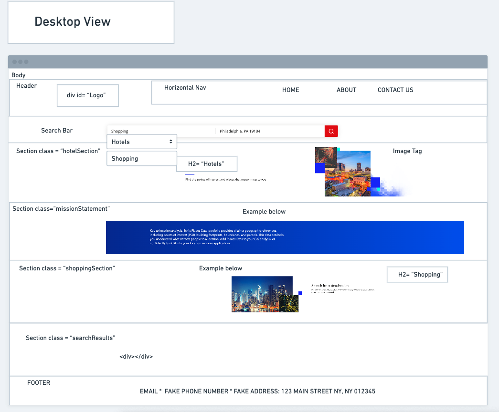

# Project-Travelers
Team 2 Project #1  Travelers

## Description
We are using the 3rd-party APIs from openweathermap.org and yelp.com. The page shows search results for the nearest Hotel, Phone number, and address, when the user searches by zipcode.  The page also shows the weather temperature and date, when the user searches by cityname.  This page should be structured with HTML which is powered by a JavaScript and CSS file linked to it which makes it dynamically responsive.

## Technologies Used  
* HTML
* CSS
* JAVASCRIPT
* BULMA
* JQUERY
* Open Weather API
* Yelp API
* Postman

## MVP

## Wireframe
The following image demonstrates the web application's Wireframe layout:

## Deployed Website
Here you can find the link to the deployed application:
https://natavenk.github.io/Project-Travelers/

## Authors
* Fatemeh Niaziorimi
* Natalia Venkatesh
* Nayonna Purnell
* Paul Hagan
* Tyler Robinson

## LICENSE
This project is licensed under the 

